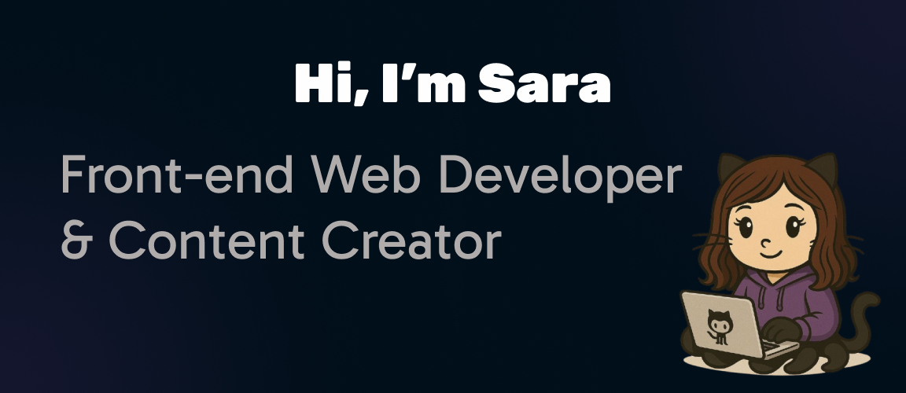

<h1 align="center">Hi  👋 I'm Sara</h1>

 

  <em>Front-End Web Developer | Passionate about building from scratch | self-taught Learner</em>

---
  
- I'm a self-taught front-end developer who loves turning ideas into interactive and visually appealing websites. What excites me most is **creating something from nothing**—starting with a blank screen and transforming it into something meaningful and functional.
  
- **Tools I Use:** HTML5, CSS3, JavaScript, React, TailwindCSS, Git & GitHub 
  
- Here’s what you can expect from my GitHub:
- 👩🏻‍💻 Real-world projects: Code and projects that you can study, use, and improve.
- 📕🔗 Tips and resources: Practical advice to help you avoid the mistakes I made.
- 🚀🤝Collaborative opportunities: I’d love to collaborate with others and contribute to open-source projects.

- How to reach me
🔗 My Instagram: [codesbysara](https://www.instagram.com/codesbysara/?theme=dark)

- 👩🏻 Pronouns: She/her
  
- ⚡ Fun fact: When I’m not coding, you can find me exploring new languages, reading books or drawing 😊

